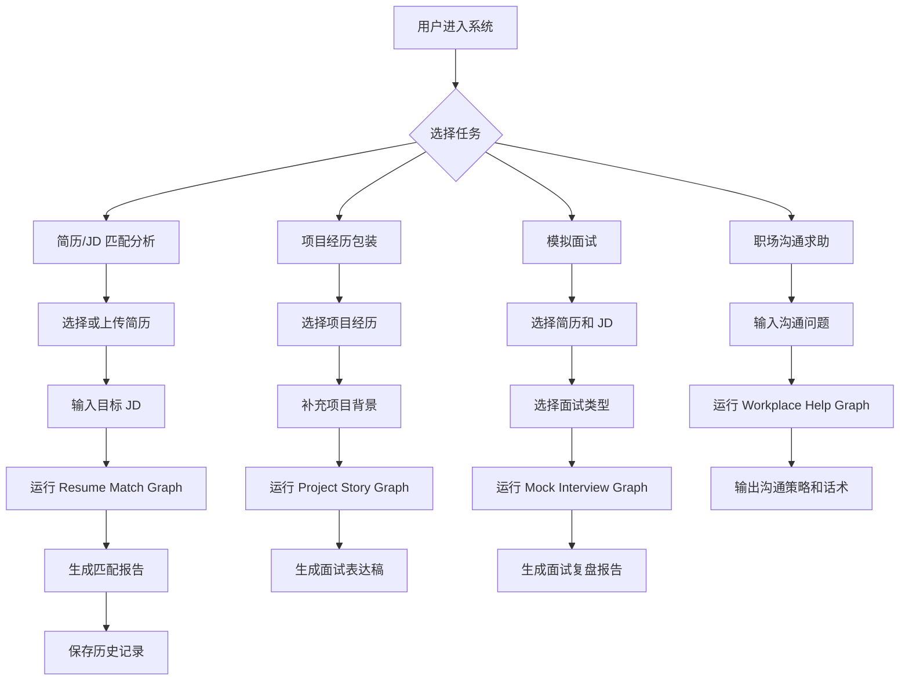
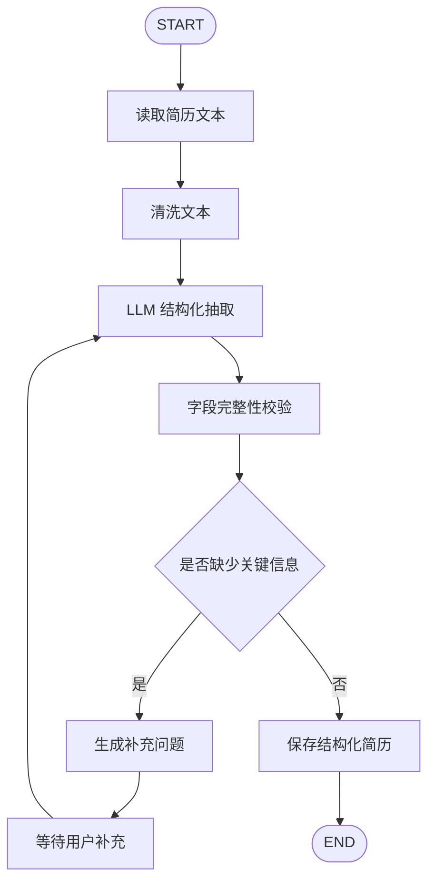
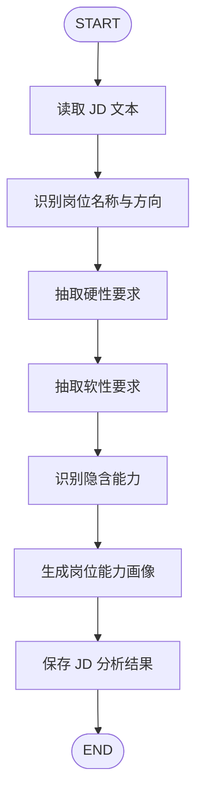
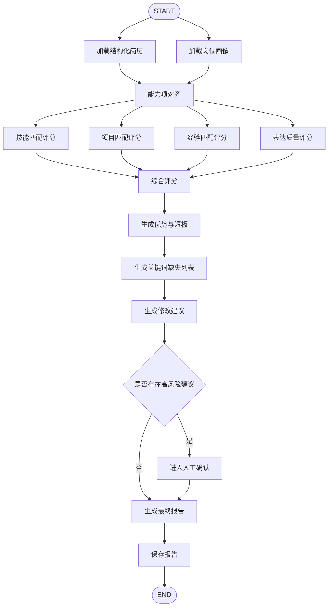
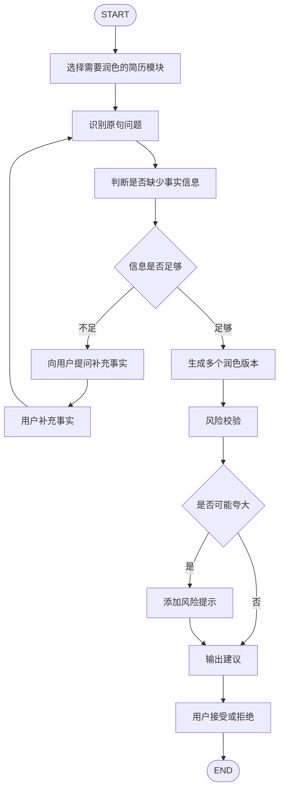
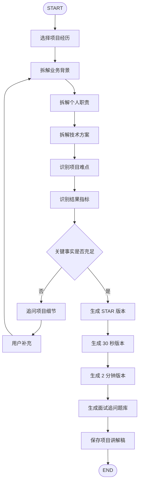
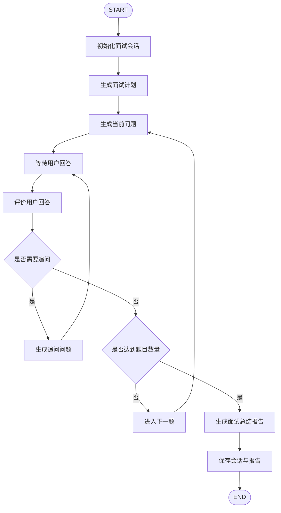
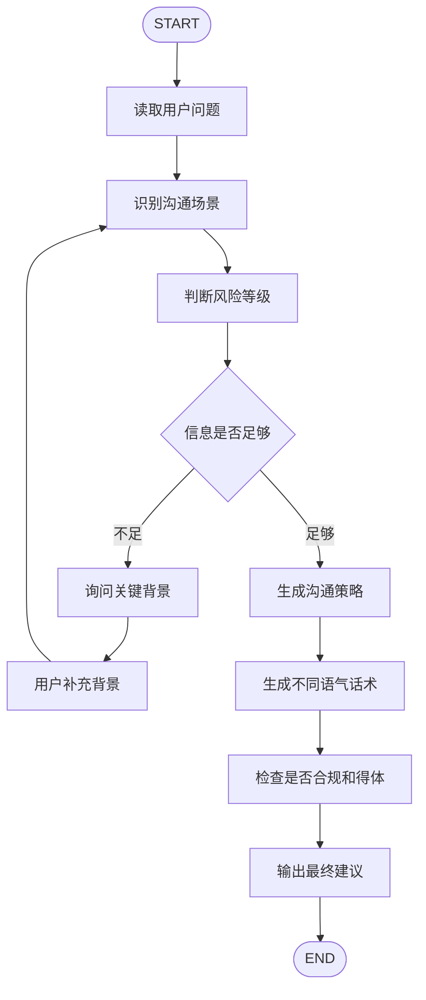

# Agent 流程图

## 1. 总体 Agent 设计

项目采用多个业务 Graph，而不是一个巨大 Agent。

推荐拆分：

- Resume Parse Graph：简历解析。
- JD Analysis Graph：岗位 JD 分析。
- Resume Match Graph：简历与 JD 匹配。
- Resume Polish Graph：简历润色建议。
- Project Story Graph：项目经历包装。
- Mock Interview Graph：模拟面试。
- Workplace Help Graph：职场沟通助手。

这样做的好处：

- 每个 Graph 的状态更清晰。
- Prompt 更容易版本化。
- 测试更容易写。
- 某个模块失败不会影响全部功能。
- 后期可以独立优化某个 Agent。

## 2. 总体业务流程

## 3. Resume Parse Graph

### 3.1 目标

将用户上传或粘贴的简历转换为结构化简历对象。

### 3.2 输入

- resume_text
- file_type
- user_id

### 3.3 输出

- structured_resume
- parse_warnings
- missing_fields

### 3.4 流程图

### 3.5 关键节点

| 节点 | 职责 | 是否调用 LLM |
| --- | --- | --- |
| clean_resume_text | 清洗乱码、空行、重复符号 | 否 |
| extract_resume_schema | 抽取结构化字段 | 是 |
| validate_resume_schema | 检查字段完整性 | 否 |
| ask_missing_info | 生成补充问题 | 是 |
| persist_resume | 保存数据库 | 否 |

## 4. JD Analysis Graph

### 4.1 目标

将岗位 JD 转换为岗位画像，用于后续匹配、模拟面试和简历润色。

### 4.2 输入

- jd_text
- target_role
- user_id

### 4.3 输出

- job_profile
- required_skills
- preferred_skills
- responsibilities
- hidden_requirements

### 4.4 流程图

### 4.5 隐含能力示例

JD 中如果出现：

- “跨部门协作”：需要沟通能力、推进能力。
- “高并发”：需要性能优化、缓存、数据库优化、压测经验。
- “从 0 到 1”：需要需求拆解、架构设计、快速迭代能力。
- “AI 应用落地”：需要 LLM API、RAG、Agent、评测、工程部署经验。

## 5. Resume Match Graph

### 5.1 目标

分析简历与 JD 的匹配度，生成可解释报告。

### 5.2 输入

- structured_resume
- job_profile
- user_preferences

### 5.3 输出

- match_score
- skill_score
- project_score
- experience_score
- expression_score
- strengths
- weaknesses
- missing_keywords
- improvement_suggestions

### 5.4 流程图

### 5.5 条件分支

高风险建议包括：

- 建议用户添加没有证据支持的经历。
- 建议过度夸大项目结果。
- 建议修改学历、年限、职位等事实信息。
- 建议隐瞒重大经历空白。

遇到高风险建议时，系统不应直接输出成“可复制简历”，而应标记为“需要用户确认事实依据”。

## 6. Resume Polish Graph

### 6.1 目标

针对简历句子生成可解释、可选择、不过度虚构的润色建议。

### 6.2 流程图

### 6.3 润色输出格式

每条建议应包含：

- section：简历模块。
- original_text：原文。
- issue：存在的问题。
- revised_text：建议改写。
- rationale：修改原因。
- evidence_needed：是否需要用户补充证据。
- risk_level：low、medium、high。

## 7. Project Story Graph

### 7.1 目标

将项目经历改造成面试可讲的结构化故事。

### 7.2 流程图

## 8. Mock Interview Graph

### 8.1 目标

模拟真实面试的多轮问答、追问和反馈。

### 8.2 状态字段

- session_id
- resume_id
- jd_id
- interview_type
- current_question
- question_index
- user_answer
- evaluation
- follow_up_needed
- conversation_history
- final_report

### 8.3 流程图

### 8.4 追问逻辑

需要追问的情况：

- 用户回答过短。
- 用户只讲结果，没有讲过程。
- 用户只讲技术名词，没有讲为什么这么选。
- 用户回答和 JD 关键能力无关。
- 用户表达中有明显逻辑断层。
- 用户提到高风险内容，例如“我不太清楚，只是参与了一点”。

## 9. Workplace Help Graph

### 9.1 目标

帮助用户处理职场沟通问题，输出策略和话术。

### 9.2 流程图

## 10. Agent 工程注意事项

### 10.1 状态设计

每个 Graph 应有独立 State，不要所有流程共用一个大 State。

建议：

- 共用字段放到 BaseAgentState。
- 业务字段放到各自 State。
- 用户输入和模型输出分开保存。
- 中间结果和最终报告分开保存。

### 10.2 持久化

LangGraph 支持通过 checkpointer 保存图状态。对于本项目：

- 开发阶段可以使用 SQLite checkpointer。
- 生产阶段可以使用 Postgres checkpointer。
- 每个用户会话使用独立 thread_id。
- 长流程，例如模拟面试，必须支持中断后恢复。

### 10.3 人工确认

适合加入 Human-in-the-loop 的节点：

- 简历事实修改。
- 高风险润色建议。
- 生成可复制的谈薪话术。
- 模拟面试最终报告确认。

### 10.4 可观测性

每次 Agent 执行需要记录：

- graph_name
- node_name
- input_summary
- output_summary
- model_name
- prompt_version
- latency_ms
- token_usage
- error_message

这部分数据后续既能排查问题，也能作为面试展示亮点。

