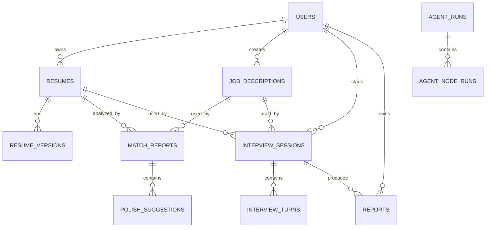

# 数据结构设计

## 1. 设计原则

数据结构设计需要同时满足产品功能、Agent 状态管理、历史追踪和后续维护。

核心原则：

- 用户输入、Agent 中间状态、最终报告分开保存。
- 简历、JD、面试会话等核心实体使用稳定 ID。
- LLM 输出尽量结构化保存，避免只有一段纯文本。
- Prompt 版本、模型名称、执行耗时和错误信息需要可追踪。
- 支持用户删除敏感数据。

## 2. 数据库选型

MVP 推荐：

- SQLite：本地开发简单。
- PostgreSQL：正式部署推荐。
- Chroma：本地向量库。

后续推荐：

- PostgreSQL + pgvector：结构化数据和向量数据统一管理。
- Redis：缓存短期会话状态。
- S3 或 MinIO：保存上传文件。

## 3. 核心实体关系



## 4. 表结构设计

### 4.1 users

保存用户基础信息。MVP 可以先做匿名用户或本地单用户模式，但表结构建议预留。

| 字段 | 类型 | 说明 |
| --- | --- | --- |
| id | uuid | 用户 ID |
| email | varchar | 邮箱 |
| display_name | varchar | 昵称 |
| password_hash | varchar | 密码哈希，MVP 可为空 |
| created_at | datetime | 创建时间 |
| updated_at | datetime | 更新时间 |
| deleted_at | datetime | 软删除时间 |

### 4.2 resumes

保存简历主记录。

| 字段 | 类型 | 说明 |
| --- | --- | --- |
| id | uuid | 简历 ID |
| user_id | uuid | 用户 ID |
| title | varchar | 简历标题 |
| source_type | varchar | text、markdown、pdf、docx |
| raw_text | text | 原始文本 |
| structured_json | jsonb | 结构化简历 |
| parse_status | varchar | pending、success、failed |
| parse_warnings | jsonb | 解析警告 |
| created_at | datetime | 创建时间 |
| updated_at | datetime | 更新时间 |
| deleted_at | datetime | 软删除时间 |

### 4.3 resume_versions

保存简历修改版本。

| 字段 | 类型 | 说明 |
| --- | --- | --- |
| id | uuid | 版本 ID |
| resume_id | uuid | 简历 ID |
| version_no | int | 版本号 |
| title | varchar | 版本标题 |
| content_text | text | 修改后文本 |
| structured_json | jsonb | 修改后结构化简历 |
| change_summary | text | 修改摘要 |
| created_by | varchar | user、agent |
| created_at | datetime | 创建时间 |

### 4.4 job_descriptions

保存岗位 JD。

| 字段 | 类型 | 说明 |
| --- | --- | --- |
| id | uuid | JD ID |
| user_id | uuid | 用户 ID |
| title | varchar | 岗位名称 |
| company_name | varchar | 公司名称，可为空 |
| raw_text | text | JD 原文 |
| job_profile_json | jsonb | 岗位画像 |
| analysis_status | varchar | pending、success、failed |
| created_at | datetime | 创建时间 |
| updated_at | datetime | 更新时间 |
| deleted_at | datetime | 软删除时间 |

### 4.5 match_reports

保存简历/JD 匹配报告。

| 字段 | 类型 | 说明 |
| --- | --- | --- |
| id | uuid | 报告 ID |
| user_id | uuid | 用户 ID |
| resume_id | uuid | 简历 ID |
| jd_id | uuid | JD ID |
| overall_score | int | 总分，0-100 |
| skill_score | int | 技能匹配分 |
| project_score | int | 项目匹配分 |
| experience_score | int | 经验匹配分 |
| expression_score | int | 表达质量分 |
| strengths_json | jsonb | 优势列表 |
| weaknesses_json | jsonb | 短板列表 |
| missing_keywords_json | jsonb | 缺失关键词 |
| suggestions_json | jsonb | 修改建议 |
| report_markdown | text | 可读报告 |
| agent_run_id | uuid | 关联 Agent 执行 |
| created_at | datetime | 创建时间 |

### 4.6 polish_suggestions

保存单条简历润色建议。

| 字段 | 类型 | 说明 |
| --- | --- | --- |
| id | uuid | 建议 ID |
| match_report_id | uuid | 匹配报告 ID |
| resume_id | uuid | 简历 ID |
| section | varchar | 简历模块 |
| original_text | text | 原文 |
| issue | text | 问题说明 |
| revised_text | text | 修改后文本 |
| rationale | text | 修改理由 |
| risk_level | varchar | low、medium、high |
| evidence_needed | boolean | 是否需要事实证据 |
| user_action | varchar | pending、accepted、rejected、edited |
| created_at | datetime | 创建时间 |
| updated_at | datetime | 更新时间 |

### 4.7 project_stories

保存项目经历包装结果。

| 字段 | 类型 | 说明 |
| --- | --- | --- |
| id | uuid | 项目讲解稿 ID |
| user_id | uuid | 用户 ID |
| resume_id | uuid | 简历 ID |
| project_name | varchar | 项目名称 |
| original_project_text | text | 项目原文 |
| star_version | text | STAR 版本 |
| short_pitch | text | 30 秒版本 |
| long_pitch | text | 2 分钟版本 |
| technical_highlights_json | jsonb | 技术亮点 |
| follow_up_questions_json | jsonb | 追问题库 |
| missing_facts_json | jsonb | 缺失事实 |
| created_at | datetime | 创建时间 |
| updated_at | datetime | 更新时间 |

### 4.8 interview_sessions

保存模拟面试会话。

| 字段 | 类型 | 说明 |
| --- | --- | --- |
| id | uuid | 会话 ID |
| user_id | uuid | 用户 ID |
| resume_id | uuid | 简历 ID |
| jd_id | uuid | JD ID |
| interview_type | varchar | hr、technical_1、technical_2、project_deep_dive、behavior |
| status | varchar | active、completed、cancelled |
| question_count_target | int | 目标题目数 |
| current_question_index | int | 当前题号 |
| final_report_json | jsonb | 最终报告 |
| final_report_markdown | text | 可读报告 |
| agent_thread_id | varchar | LangGraph thread_id |
| created_at | datetime | 创建时间 |
| updated_at | datetime | 更新时间 |

### 4.9 interview_turns

保存每轮面试问答。

| 字段 | 类型 | 说明 |
| --- | --- | --- |
| id | uuid | 回合 ID |
| session_id | uuid | 面试会话 ID |
| turn_index | int | 回合序号 |
| question | text | 面试问题 |
| question_type | varchar | skill、project、behavior、hr |
| user_answer | text | 用户回答 |
| evaluation_json | jsonb | 评价结果 |
| score | int | 本题分数 |
| follow_up_needed | boolean | 是否需要追问 |
| parent_turn_id | uuid | 如果是追问，指向上一个 turn |
| created_at | datetime | 创建时间 |

### 4.10 workplace_requests

保存职场沟通请求。

| 字段 | 类型 | 说明 |
| --- | --- | --- |
| id | uuid | 请求 ID |
| user_id | uuid | 用户 ID |
| scenario_type | varchar | salary、hr_reply、delay、conflict、promotion、other |
| user_input | text | 用户问题 |
| context_json | jsonb | 补充背景 |
| risk_level | varchar | low、medium、high |
| strategy | text | 沟通策略 |
| scripts_json | jsonb | 多语气话术 |
| warnings_json | jsonb | 风险提示 |
| created_at | datetime | 创建时间 |

### 4.11 agent_runs

保存一次 Graph 执行。

| 字段 | 类型 | 说明 |
| --- | --- | --- |
| id | uuid | Agent 执行 ID |
| user_id | uuid | 用户 ID |
| graph_name | varchar | Graph 名称 |
| thread_id | varchar | LangGraph thread_id |
| status | varchar | running、success、failed、interrupted |
| input_summary | text | 输入摘要，避免保存完整敏感文本 |
| output_summary | text | 输出摘要 |
| model_name | varchar | 模型名称 |
| prompt_version | varchar | Prompt 版本 |
| started_at | datetime | 开始时间 |
| finished_at | datetime | 结束时间 |
| error_message | text | 错误信息 |

### 4.12 agent_node_runs

保存 Graph 中每个节点的执行情况。

| 字段 | 类型 | 说明 |
| --- | --- | --- |
| id | uuid | 节点执行 ID |
| agent_run_id | uuid | Agent 执行 ID |
| node_name | varchar | 节点名称 |
| status | varchar | success、failed、skipped |
| input_json | jsonb | 节点输入摘要或脱敏输入 |
| output_json | jsonb | 节点输出 |
| latency_ms | int | 耗时 |
| token_usage_json | jsonb | token 使用量 |
| error_message | text | 错误信息 |
| created_at | datetime | 创建时间 |

## 5. 结构化输出 Schema

### 5.1 ResumeProfile

```json
{
  "basic_info": {
    "name": "string",
    "email": "string",
    "phone": "string",
    "location": "string"
  },
  "education": [
    {
      "school": "string",
      "degree": "string",
      "major": "string",
      "start_date": "string",
      "end_date": "string"
    }
  ],
  "skills": [
    {
      "name": "string",
      "category": "backend | frontend | ai | data | devops | soft_skill | other",
      "evidence": ["string"]
    }
  ],
  "work_experiences": [
    {
      "company": "string",
      "role": "string",
      "start_date": "string",
      "end_date": "string",
      "responsibilities": ["string"],
      "achievements": ["string"]
    }
  ],
  "projects": [
    {
      "name": "string",
      "description": "string",
      "tech_stack": ["string"],
      "role": "string",
      "responsibilities": ["string"],
      "achievements": ["string"],
      "metrics": ["string"]
    }
  ]
}
```

### 5.2 JobProfile

```json
{
  "job_title": "string",
  "role_direction": "backend | frontend | ai_engineer | data | product | other",
  "required_skills": [
    {
      "skill": "string",
      "importance": "high | medium | low",
      "evidence_from_jd": "string"
    }
  ],
  "preferred_skills": [
    {
      "skill": "string",
      "importance": "high | medium | low",
      "evidence_from_jd": "string"
    }
  ],
  "responsibilities": ["string"],
  "hidden_requirements": [
    {
      "requirement": "string",
      "reason": "string"
    }
  ]
}
```

### 5.3 MatchReport

```json
{
  "overall_score": 82,
  "score_breakdown": {
    "skill_score": 85,
    "project_score": 80,
    "experience_score": 78,
    "expression_score": 86
  },
  "strengths": [
    {
      "title": "string",
      "evidence": "string",
      "related_jd_requirement": "string"
    }
  ],
  "weaknesses": [
    {
      "title": "string",
      "reason": "string",
      "impact": "string"
    }
  ],
  "missing_keywords": ["string"],
  "polish_suggestions": [
    {
      "section": "string",
      "original_text": "string",
      "issue": "string",
      "revised_text": "string",
      "rationale": "string",
      "risk_level": "low | medium | high",
      "evidence_needed": true
    }
  ],
  "interview_risks": [
    {
      "risk": "string",
      "possible_question": "string",
      "preparation_advice": "string"
    }
  ]
}
```

## 6. 索引与查询建议

建议创建索引：

- resumes.user_id
- job_descriptions.user_id
- match_reports.user_id
- match_reports.resume_id
- match_reports.jd_id
- interview_sessions.user_id
- interview_turns.session_id
- agent_runs.user_id
- agent_runs.thread_id

向量索引建议：

- 简历项目经历片段。
- JD 要求片段。
- 面试题库。
- 简历润色规则。
- 职场沟通模板。

## 7. 隐私处理

敏感字段包括：

- 姓名。
- 手机号。
- 邮箱。
- 公司名称。
- 简历全文。
- 面试回答。

建议：

- 日志只保存摘要，不保存完整简历。
- 前端删除操作使用软删除，后台可定期硬删除。
- 导出报告时提醒用户检查隐私信息。
- 开发测试数据不要使用真实个人隐私。

