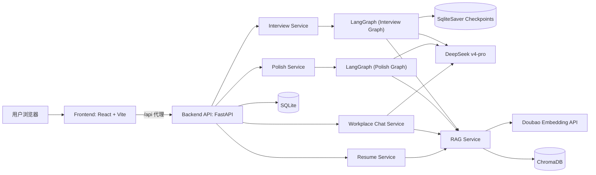
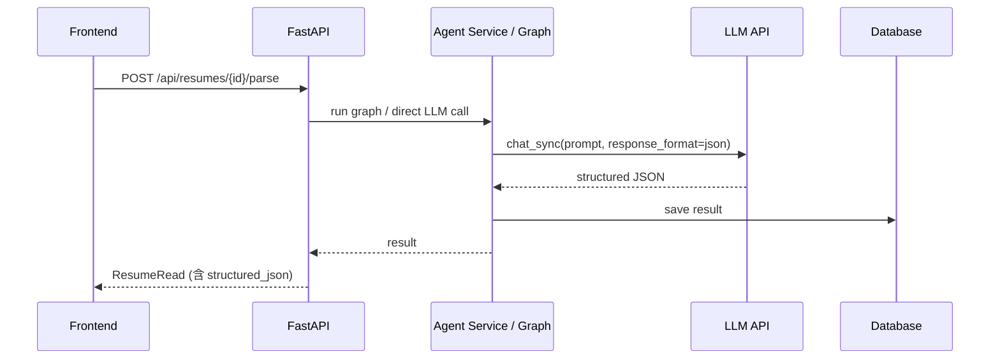
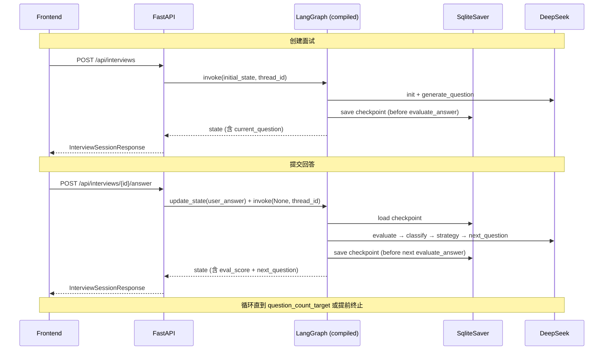
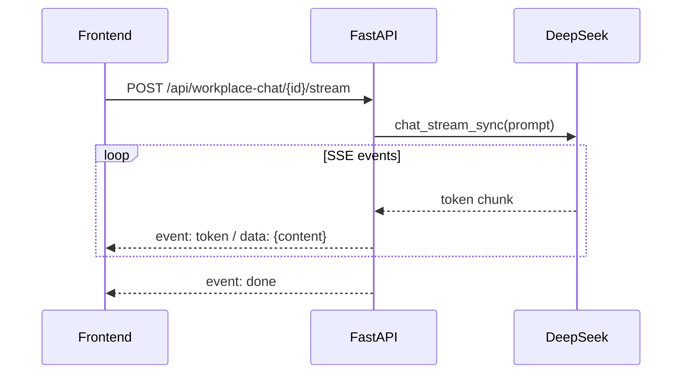
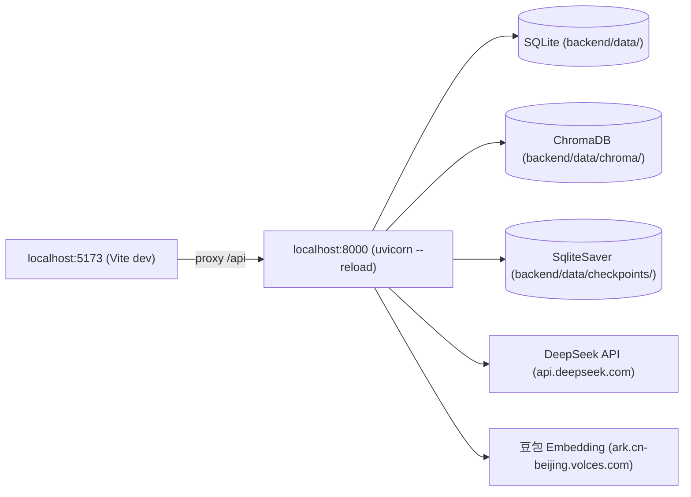
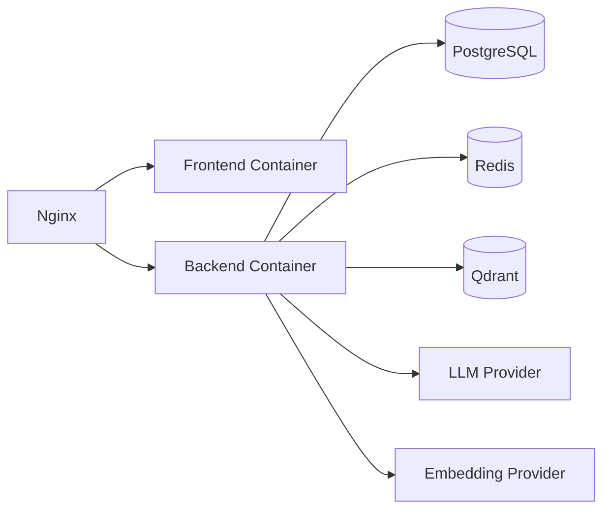

# 技术架构说明

## 1. 架构目标

本项目采用前后端分离架构，目标是让 UI、业务 API、Agent 工作流、数据存储、模型供应商之间保持清晰边界。

架构需要满足：

- Web 页面可演示。
- Agent 工作流可独立测试。
- 模型可替换。
- Prompt 可版本化。
- 数据可持久化。
- 执行过程可观测。
- 后续可从单机部署演进到云部署。

## 2. AI 使用方式总览

本项目在多处使用了 AI 能力，不是简单"调一个 LLM"，而是根据不同场景匹配不同的 AI 策略：

### 2.1 用到的 AI 模型

| 模型 | 用途 | 调用方式 |
| --- | --- | --- |
| DeepSeek v4-pro | LLM：简历解析、面试出题/评估/报告、简历润色、职场沟通 | OpenAI 兼容 API（同步 + 流式） |
| 豆包 Doubao embedding | Embedding：文本向量化，支撑 RAG 检索 | 火山方舟 multimodal embedding API |

### 2.2 LLM 使用场景

**简历解析**（`POST /api/resumes/{id}/parse`）：
- 快速解析：无 LLM，纯规则提取基本信息
- AI 精修：将原始简历文本 + 快速解析结果发给 DeepSeek，要求按结构化 schema 输出 JSON
- 失败兜底：AI 精修失败时保留快速解析结果

**模拟面试**（`POST /api/interviews`）：
- 出题：DeepSeek 根据用户简历（RAG 检索相关经历）+ 已问话题 + 难度级别，生成有针对性的问题
- 评估：DeepSeek 对回答评分，输出优势/改进/风险，返回 JSON
- 分类：根据评分将回答分为 weak/medium/strong 三档
- 策略决策：weak → 降低难度追问（probe_easier），medium → 同话题深挖（follow_up_detail），strong → 换话题提升难度（switch_topic_harder）
- 报告：DeepSeek 汇总所有轮次评估，生成综合报告

**简历润色**（`POST /api/resumes/{id}/polish`）：
- 分析 + 生成建议：DeepSeek 一次调用输出所有润色建议，每条标注 risk_level（low/medium/high）
- 风险审查（LLM-as-Judge）：只对 high 风险建议走二次 LLM 验证，过滤"编造经历"等不合规内容
- 成本控制：90% 的 low/medium 建议跳过审查，节省 token

**职场沟通**（`POST /api/workplace-chat/{id}/stream`）：
- DeepSeek 流式生成沟通草稿，支持 7 种职场场景和 4 种语气
- 输出中嵌入 `<<<DRAFT>>><<<END_DRAFT>>>` 和 `<<<PITFALL>>><<<END_PITFALL>>>` 标记，解析为正文+避坑提示

### 2.3 Embedding + RAG 使用场景

**分层检索策略**（核心巧思）：不同 agent 用不同的检索策略，而不是"一坨文本拼进去"。

|| Agent | 检索策略 | 检索内容 | 作用 |
|| --- | --- | --- | --- |
|| 面试出题 | 按技能/项目维度 | 简历经历片段（experience/project） | 出针对用户真实经历的题，不是泛泛而问 |
|| 润色分析 | 按表述相似度 | 历史润色建议（polish_suggestion） | 保持建议风格一致 |
|| 职场沟通 | 按职位身份 | 简历 profile + experience | 生成贴合用户身份的草稿 |

**文本分段入库策略**：
- 工作经历：公司 + 职位 + 时间 + 职责
- 项目经历：项目名 + 技术栈 + 描述 + 成果
- 技能标签：技能名 + 分类 + 证据
- 基本信息：姓名 + 邮箱 + 教育

每种分段带 metadata（doc_type, section_type, resume_id），方便按条件过滤检索。

### 2.4 LangGraph Agent 工作流

**面试 Agent（自适应循环图）**：
```
init_interview → generate_question → [等待用户回答]
  → evaluate_answer → classify_answer → decide_strategy
       ↓                    ↓                  ↓
    score/评估        weak/medium/strong    三分支路由
                                                  ↓
  probe_easier / follow_up_detail / switch_topic_harder
       ↓
  next_question → generate_question（循环）或 final_report
```

设计要点：
- 不是简单的 DAG，而是根据回答质量动态调整策略的循环图
- `interrupt_before=['evaluate_answer']` 实现暂停等待用户输入
- SqliteSaver checkpoint 支持暂停/恢复/重放（"时间旅行"）
- 连续 2 次 weak → 提前终止出报告（不浪费时间）

**润色 Agent（5 节点图）**：
```
load_resume → analyze_issues → generate_suggestions → risk_gate → format_report
                                                           ↓              ↑
                                                     validate_risks ──────┘
                                                      （仅 high risk 走这条）
```

设计要点：
- risk_gate 条件分支：按风险等级分流，控制 LLM 调用成本
- validate_risks：LLM-as-Judge 二次审查

## 3. 推荐技术栈

### 3.1 当前技术栈

| 层 | 技术 | 说明 |
| --- | --- | --- |
| 前端 | React 18 + Vite + TypeScript | SPA，Vite 代理转发 /api 到后端 |
| 后端 | FastAPI | Python 同步路由 + uvicorn |
| Agent 编排 | LangGraph 0.2+ | 面试循环图 + 润色 DAG，含 checkpoint |
| LLM | DeepSeek v4-pro | OpenAI 兼容接口（同步 + 流式） |
| Embedding | 豆包 Doubao embedding | 火山方舟 multimodal API，2048 维向量 |
| 向量库 | ChromaDB | SQLite 级别轻量向量库，本地持久化 |
| 数据库 | SQLite | MVP 阶段，通过 SQLAlchemy ORM 访问 |
| 文件解析 | python-docx + 文本解析 | 支持 .docx .doc .txt .md |
| 日志 | Python logging | 结构化日志 |
| 观测 | LangSmith（可选） | 通过环境变量开关控制 |

### 3.2 生产化演进

| 层 | 当前 | 生产化 |
| --- | --- | --- |
| 向量库 | ChromaDB | pgvector 或 Qdrant |
| 数据库 | SQLite | PostgreSQL |
| 缓存 | 无 | Redis |
| 任务队列 | 同步处理 | Celery / Dramatiq |
| 文件存储 | 本地 | S3 / MinIO |
| 部署 | 本地 uvicorn | Docker Compose / K8s |

## 4. 总体架构图



## 5. 前后端分离设计

### 5.1 前端职责

前端只负责：
- 页面路由。
- 用户输入。
- 文件上传（DOCX/TXT/MD）。
- 展示 Agent 执行进度。
- 展示结构化报告（简历解析、润色建议、面试报告）。
- 展示历史记录。
- 管理用户交互状态。

前端不负责：
- Prompt 拼接。
- LLM 调用。
- 复杂业务判断。
- 数据库直接访问。
- Agent 状态管理。

### 5.2 后端职责

后端负责：
- API 鉴权（JWT）。
- 文件处理（DOCX 文本提取）。
- 数据库读写。
- Agent 任务启动。
- Agent 结果保存。
- 报告查询。
- 脱敏和日志。

### 5.3 Agent Service 职责

Agent Service 负责：
- 加载对应 Graph。
- 管理 Graph State。
- 调用 LLM。
- 调用 Tool（load_resume_tool, search_history_tool, save_report_tool）。
- 通过 checkpoint 处理中断和恢复。
- 保存执行记录。
- 输出结构化结果。

## 6. 实际目录结构

```text
careerpilot-resume-agent/
  frontend/
    src/
      pages/
        ResumeAnalysisPage.tsx     # 简历上传 + 列表 + 解析展示
        ResumePolishPage.tsx       # 简历润色
        MockInterviewPage.tsx       # 模拟面试（三栏布局）
        WorkplaceHelpPage.tsx      # 职场沟通
      components/
        Sidebar.tsx / Topbar.tsx / Card.tsx / ...
      api/
        client.ts                 # fetch 封装（含 JWT 鉴权）
        resumes.ts / interviews.ts / polish.ts / workplaceChat.ts
  backend/
    app/
      main.py
      core/
        config.py                 # pydantic Settings（LLM + Embedding + LangSmith）
        security.py               # JWT 签发/校验
      api/
        routes_resumes.py         # 简历 CRUD + 上传 + 解析
        routes_interviews.py      # 面试会话 + 答题 + 结束
        routes_polish.py          # 简历润色（调用 Polish Graph）
        routes_workplace_chat.py  # 职场沟通（SSE 流式）
        routes_settings.py        # 模型配置状态
        deps.py                   # 依赖注入（get_db, get_current_user_id）
      agents/
        base/
          runtime.py              # RuntimeContext + PromptLoader
        mock_interview/
          graph.py                # 自适应循环图 + checkpoint 编译
          nodes.py                # 节点实现（含 RAG 检索）
          state.py                # InterviewState
        resume_polish/
          graph.py                # 5 节点润色图
          nodes.py                # 含 risk_gate + validate_risks
          state.py                # PolishState
        resume_match/
          graph.py / nodes.py / state.py
        tools.py                  # 共享 Tool 定义
      prompts/
        resume_parse/v1.yaml
        resume_polish/v1.yaml
        mock_interview/
          v1_generate_question.yaml
          v1_evaluate_answer.yaml
          v1_final_report.yaml
        workplace_chat/v1.yaml
      services/
        llm/
          deepseek_provider.py    # DeepSeek Provider（OpenAI SDK）
          factory.py
        embedding.py              # 豆包 Embedding API 封装
        vector_store.py           # ChromaDB 封装（add/query/delete）
        rag_service.py            # 分层检索策略 + 简历入库
        resume_file_parser.py     # DOCX/TXT/MD 文本提取
        resume_quick_parser.py    # 快速解析（无 LLM）
        resume_schema_normalizer.py
        resume_text_cleaner.py
      models/
        resume.py / interview.py / job_description.py / workplace_chat.py
      db/
        session.py
      tests/
  docs/
```

## 7. API 设计

### 7.1 简历接口

```text
POST   /api/resumes                      # 创建（纯文本）
POST   /api/resumes/upload               # 上传文件（DOCX/TXT/MD）
GET    /api/resumes                      # 列表
GET    /api/resumes/{resume_id}          # 详情（含 structured_json）
DELETE /api/resumes/{resume_id}          # 软删除
POST   /api/resumes/{resume_id}/parse    # 触发解析（快速 + AI 精修）
POST   /api/resumes/{resume_id}/polish   # 简历润色
```

### 7.2 模拟面试接口

```text
POST   /api/interviews                       # 创建面试会话，返回首题
GET    /api/interviews/{session_id}          # 获取会话状态
POST   /api/interviews/{session_id}/answer   # 提交答案，返回评估+下一题
POST   /api/interviews/{session_id}/finish   # 提前结束，生成报告
```

### 7.3 职场沟通接口

```text
GET    /api/workplace-chat                   # 会话列表
POST   /api/workplace-chat                   # 创建会话
GET    /api/workplace-chat/{session_id}      # 获取会话详情
POST   /api/workplace-chat/{session_id}/stream       # SSE 流式生成回复
DELETE /api/workplace-chat/{session_id}      # 删除会话
```

## 8. Agent 与 API 的交互模式

### 8.1 同步模式（简历解析、润色、职场沟通）



### 8.2 中断-恢复模式（模拟面试）

面试 agent 是交互式循环图，需要等待用户输入。通过 LangGraph 的 `interrupt_before` + `SqliteSaver` checkpoint 实现：



### 8.3 流式模式（职场沟通）



## 9. LangGraph 设计要点

### 9.1 面试 Agent：自适应循环图

图不是简单的 DAG，而是根据回答质量动态调整的循环图：

- `classify_answer`：根据评分将回答分为 weak（<50）/ medium（50-74）/ strong（≥75）
- `decide_strategy` 条件分支：
  - weak → `probe_easier`（降低难度追问同一话题）
  - medium → `follow_up_detail`（同话题追问细节）
  - strong → `switch_topic_harder`（换话题出更难题）
- 早期终止：连续 2 次 weak → 直接走 `final_report`
- `interrupt_before=['evaluate_answer']` 让图在每个问题后暂停等待用户输入
- `SqliteSaver` checkpoint 支持暂停/恢复/重放（"时间旅行"）

### 9.2 润色 Agent：风险分级图

- `risk_gate` 条件分支：按风险等级分流
  - 有 high 风险建议 → 走 `validate_risks`（LLM-as-Judge）
  - 全部 low/medium → 跳过验证直接 `format_report`
- 成本控制：90% 的建议是措辞优化（低风险），不需要二次审查

### 9.3 状态管理

所有 Agent 图的状态用 `TypedDict` 定义，字段明确。图的节点函数签名统一为 `(state, runtime) -> dict`，返回部分状态更新，LangGraph 自动合并。

## 10. Prompt 管理

Prompt 从代码中分离为 YAML 文件：

```yaml
name: interview_generate_question
version: v1
description: 根据简历和对话历史生成下一个面试问题
system: |
  你是一位资深面试官...
user_template: |
  面试类型: {{ interview_type }}
  当前进度: 第 {{ current_index }}/{{ total_count }} 题
  ...
```

管理要求：
- 每个 Prompt 有 name 和 version。
- Prompt 修改需要记录 changelog。
- 关键 Prompt 需要配测试样例。
- 不要在代码里散落多份相似 Prompt。

## 11. 模型 Provider 抽象

**LLM Provider（DeepSeek）**：
- 使用 OpenAI Python SDK，兼容 `chat.completions.create` 接口
- 支持同步（`chat_sync`）、异步（`chat`）、流式（`chat_stream_sync`）三种模式
- 通过 `settings.DEEPSEEK_API_KEY/BASE_URL/MODEL` 配置
- 运行时通过 `RuntimeContext.llm_provider` 获取，节点不直接依赖全局配置

**Embedding Provider（豆包）**：
- 使用火山方舟 multimodal embedding API
- OpenAI 兼容接口，通过 `httpx` 直接调用
- 通过 `settings.DOUBAO_EMBEDDING_API_KEY/MODEL` 配置

**可替换性**：切换 LLM 只需新建一个 Provider 类，切换 Embedding 只需改 `embedding.py`。

## 12. 部署架构

### 12.1 本地开发



### 12.2 Docker Compose（规划中）



## 13. 可观测性

### 13.1 应用日志

Python logging 记录：API 请求、用户操作、任务状态、错误堆栈。

### 13.2 Agent 节点日志

每个 Graph Node 执行前后记录：Graph 名称、Node 名称、输入/输出摘要、耗时。

### 13.3 LangSmith Trace（可选）

通过环境变量 `LANGCHAIN_TRACING_V2=true` 开启后，LangGraph/LangChain 自动上报：
- 模型调用链路。
- Tool 调用。
- 节点耗时和 token 消耗。
- Prompt 输入输出。
- 多轮会话 thread。

## 14. 安全设计

### 14.1 API Key

- 使用 `.env` 保存所有密钥（LLM + Embedding + LangSmith）。
- 提供 `.env.example`。
- `.env` 加入 `.gitignore`。

### 14.2 认证

- 前端登录获取 JWT token，存入 localStorage。
- 所有 API 请求带 `Authorization: Bearer <token>`。
- 后端通过 `get_current_user_id` 依赖注入校验，按 user_id 隔离数据。

### 14.3 数据隔离

- 所有数据库查询带 `user_id` 过滤。
- ChromaDB 按 `user_{user_id}` 创建独立 collection。
- Graph checkpoint 按 `thread_id`（= session_id）隔离。
