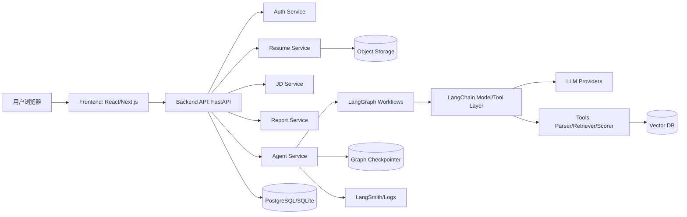
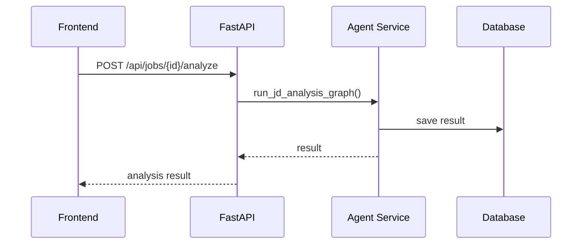
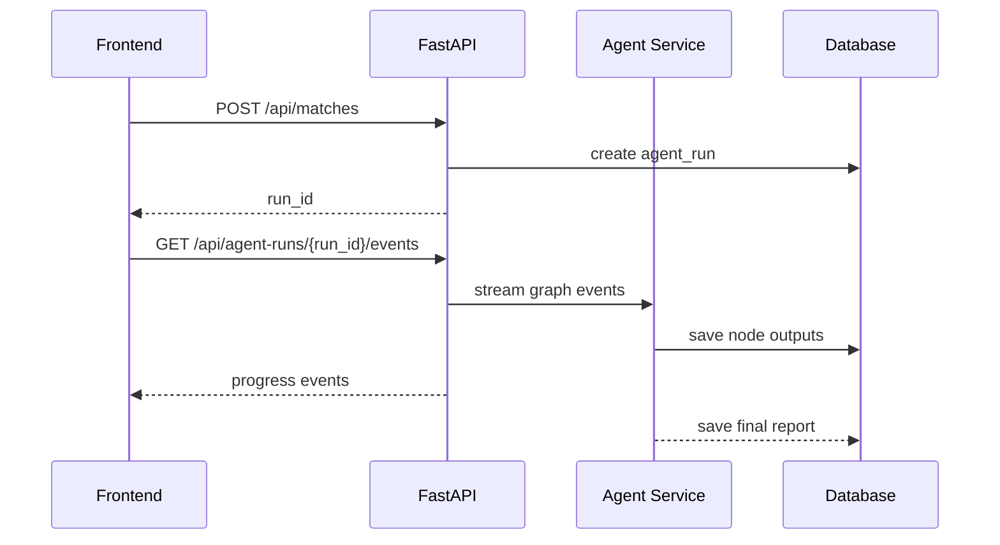
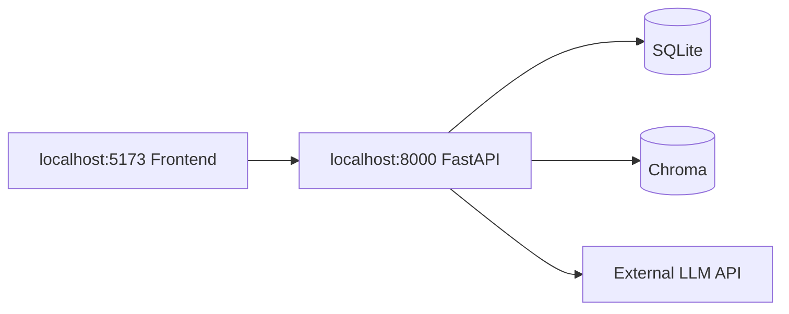
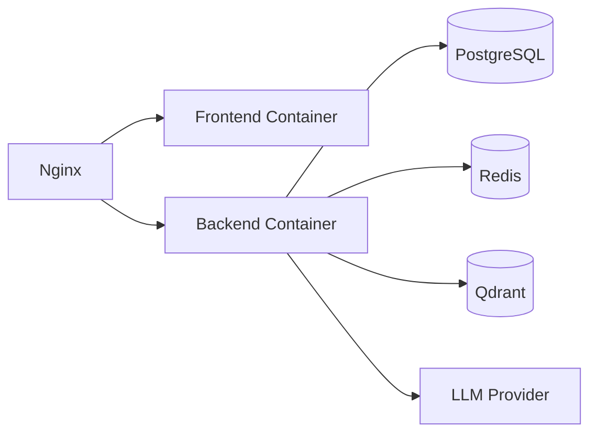

# 技术架构说明

## 1. 架构目标

本项目采用前后端分离架构，目标是让 UI、业务 API、Agent 工作流、数据存储、模型供应商之间保持清晰边界。

架构需要满足：

- Web 页面可演示。
- Agent 工作流可独立测试。
- 模型可替换。
- Prompt 可版本化。
- 数据可持久化。
- 执行过程可观测。
- 后续可从单机部署演进到云部署。

## 2. 推荐技术栈

### 2.1 MVP 技术栈

| 层 | 技术 |
| --- | --- |
| 前端 | React + Vite 或 Next.js |
| 后端 | FastAPI |
| Agent 编排 | LangGraph |
| LLM 集成 | LangChain |
| 数据库 | SQLite |
| 向量库 | Chroma |
| 文件解析 | Python 文本解析，第二阶段加入 PDF/DOCX |
| 日志 | Python logging + 结构化 JSON 日志 |
| 本地部署 | Docker Compose |

### 2.2 生产化技术栈

| 层 | 技术 |
| --- | --- |
| 前端 | Next.js |
| 后端 | FastAPI |
| Agent 编排 | LangGraph |
| 模型接入 | 默认 DeepSeek，使用 OpenAI 兼容接口；预留 OpenAI、Qwen、Ollama 等 Provider 抽象 |
| 数据库 | PostgreSQL |
| 向量库 | pgvector 或 Qdrant |
| 文件存储 | S3 或 MinIO |
| 缓存 | Redis |
| 任务队列 | Celery、RQ 或 Dramatiq |
| 观测 | LangSmith + OpenTelemetry |
| 部署 | Docker Compose、云服务器、Kubernetes 可选 |

## 3. 总体架构图



## 4. 前后端分离设计

### 4.1 前端职责

前端只负责：

- 页面路由。
- 用户输入。
- 文件上传。
- 展示 Agent 执行进度。
- 展示结构化报告。
- 展示历史记录。
- 管理用户交互状态。

前端不负责：

- Prompt 拼接。
- LLM 调用。
- 复杂业务判断。
- 数据库直接访问。
- Agent 状态管理。

### 4.2 后端职责

后端负责：

- API 鉴权。
- 文件处理。
- 数据库读写。
- Agent 任务启动。
- Agent 结果保存。
- 报告查询。
- 脱敏和日志。

### 4.3 Agent Service 职责

Agent Service 负责：

- 加载对应 Graph。
- 管理 Graph State。
- 调用 LLM。
- 调用工具。
- 处理中断和恢复。
- 保存执行记录。
- 输出结构化结果。

## 5. 推荐目录结构

```text
careerpilot-resume-agent/
  frontend/
    src/
      pages/
      components/
      features/
        resume/
        jd/
        match/
        interview/
        workplace/
      api/
      types/
      stores/
  backend/
    app/
      main.py
      api/
        routes_resume.py
        routes_jd.py
        routes_match.py
        routes_interview.py
        routes_workplace.py
        routes_reports.py
      agents/
        base/
        resume_parse/
        jd_analysis/
        resume_match/
        resume_polish/
        project_story/
        mock_interview/
        workplace_help/
      prompts/
        resume_parse/v1.yaml
        jd_analysis/v1.yaml
        resume_match/v1.yaml
        resume_polish/v1.yaml
        project_story/v1.yaml
        mock_interview/v1.yaml
        workplace_help/v1.yaml
      schemas/
        resume.py
        jd.py
        match.py
        interview.py
        workplace.py
      services/
        llm_provider.py
        file_parser.py
        vector_store.py
        report_service.py
        privacy_service.py
      models/
        user.py
        resume.py
        jd.py
        report.py
        interview.py
        agent_run.py
      db/
        session.py
        migrations/
      tests/
  docs/
  docker-compose.yml
  README.md
  .env.example
```

## 6. API 设计

### 6.1 简历接口

```text
POST   /api/resumes
GET    /api/resumes
GET    /api/resumes/{resume_id}
DELETE /api/resumes/{resume_id}
POST   /api/resumes/{resume_id}/parse
```

### 6.2 JD 接口

```text
POST   /api/jobs
GET    /api/jobs
GET    /api/jobs/{jd_id}
DELETE /api/jobs/{jd_id}
POST   /api/jobs/{jd_id}/analyze
```

### 6.3 匹配分析接口

```text
POST /api/matches
GET  /api/matches/{match_report_id}
GET  /api/matches
```

请求示例：

```json
{
  "resume_id": "uuid",
  "jd_id": "uuid",
  "options": {
    "target_level": "junior",
    "language_style": "professional"
  }
}
```

### 6.4 简历润色接口

```text
POST /api/polish
POST /api/polish/{suggestion_id}/accept
POST /api/polish/{suggestion_id}/reject
POST /api/polish/{suggestion_id}/edit
```

### 6.5 模拟面试接口

```text
POST /api/interviews
GET  /api/interviews/{session_id}
POST /api/interviews/{session_id}/answer
POST /api/interviews/{session_id}/finish
GET  /api/interviews/{session_id}/report
```

### 6.6 职场沟通接口

```text
POST /api/workplace/help
GET  /api/workplace/requests
GET  /api/workplace/requests/{request_id}
```

### 6.7 报告接口

```text
GET    /api/reports
GET    /api/reports/{report_id}
DELETE /api/reports/{report_id}
```

## 7. Agent 与 API 的交互模式

### 7.1 同步模式

适合短任务：

- JD 分析。
- 职场沟通话术。
- 单条简历润色。

流程：



### 7.2 异步模式

适合长任务：

- 简历/JD 完整匹配。
- 模拟面试。
- 多版本简历生成。

流程：



MVP 可以先用同步模式，后续用 Server-Sent Events 或 WebSocket 展示 Agent 进度。

## 8. LangGraph 设计建议

### 8.1 为什么使用 LangGraph

这个项目有明显的状态流转：

- 简历解析后才能做匹配。
- 匹配报告生成后才能做润色建议。
- 模拟面试需要多轮循环。
- 高风险建议需要人工确认。
- 长流程需要恢复。

这些能力更适合用 Graph 表达，而不是把所有逻辑写进一个 prompt。

### 8.2 Graph 状态示例

```python
class ResumeMatchState(TypedDict):
    user_id: str
    resume_id: str
    jd_id: str
    structured_resume: dict
    job_profile: dict
    skill_score: int
    project_score: int
    experience_score: int
    expression_score: int
    overall_score: int
    strengths: list[dict]
    weaknesses: list[dict]
    missing_keywords: list[str]
    polish_suggestions: list[dict]
    risk_flags: list[dict]
    final_report: dict
```

### 8.3 Node 命名规范

推荐：

- parse_resume
- analyze_jd
- align_capabilities
- score_skills
- score_projects
- generate_suggestions
- validate_risks
- human_review
- persist_report

不要使用含义模糊的命名：

- run_agent
- process
- step1
- llm_call

## 9. Prompt 管理

Prompt 必须从代码中分离。

推荐格式：

```yaml
name: resume_match
version: v1
description: Analyze resume and JD matching.
system: |
  你是一个专业的技术招聘顾问...
user_template: |
  简历结构化信息：
  {{ resume_profile }}

  岗位画像：
  {{ job_profile }}

  请输出符合 schema 的 JSON。
output_schema: MatchReport
```

管理要求：

- 每个 Prompt 有 name 和 version。
- Prompt 修改需要记录 changelog。
- 关键 Prompt 需要配测试样例。
- 不要在代码里散落多份相似 Prompt。

## 10. 模型 Provider 抽象

不要把模型调用写死。

建议接口：

```python
class LLMProvider:
    def chat(self, messages: list[dict], schema: type | None = None) -> dict:
        ...

    def stream(self, messages: list[dict]):
        ...
```

MVP 默认使用：

- DeepSeek。
- Base URL：https://api.deepseek.com
- 默认模型：deepseek-v4-pro

后续可以继续支持：

- OpenAI。
- Qwen。
- 本地 Ollama。

环境变量：

```text
LLM_PROVIDER=deepseek
DEEPSEEK_API_KEY=...
DEEPSEEK_BASE_URL=https://api.deepseek.com
DEEPSEEK_MODEL=deepseek-v4-pro
OPENAI_API_KEY=...
QWEN_API_KEY=...
```

真实 API Key 只能写入本地 `.env`，不能写入 README、文档、代码或提交到 Git 仓库。

## 11. 部署架构

### 11.1 本地开发



### 11.2 Docker Compose



## 12. 可观测性

建议保留三类观测数据：

### 12.1 应用日志

记录：

- API 请求。
- 用户操作。
- 任务状态。
- 错误堆栈。

### 12.2 Agent 节点日志

记录：

- Graph 名称。
- Node 名称。
- 输入摘要。
- 输出摘要。
- 耗时。
- Token 使用量。

### 12.3 Trace

接入 LangSmith 后，可以展示：

- 模型调用链路。
- 工具调用。
- 节点耗时。
- Prompt 输入输出。
- 多轮会话 thread。

这部分非常适合面试时展示工程化能力。

## 13. 安全设计

### 13.1 API Key

- 使用 `.env` 保存本地密钥。
- 提供 `.env.example`。
- `.env` 加入 `.gitignore`。

### 13.2 数据脱敏

日志中避免直接保存：

- 手机号。
- 邮箱。
- 简历全文。
- 身份证号。
- 详细住址。

### 13.3 用户确认

以下行为需要用户确认：

- 生成目标岗位版简历。
- 接受高风险润色建议。
- 导出包含个人隐私的报告。
- 删除简历和报告。

## 14. 开发里程碑

### Milestone 1：文档与骨架

- 完成需求文档。
- 完成架构文档。
- 初始化前后端项目。
- 配置代码规范。

### Milestone 2：简历与 JD

- 简历文本输入。
- JD 文本输入。
- 结构化解析。
- 数据库存储。

### Milestone 3：匹配分析

- Resume Match Graph。
- 结构化匹配报告。
- 报告页面。

### Milestone 4：简历润色

- Resume Polish Graph。
- 建议接受/拒绝。
- 简历版本管理。

### Milestone 5：模拟面试

- Mock Interview Graph。
- 多轮问答。
- 回答评价。
- 最终报告。

### Milestone 6：工程化增强

- Prompt 版本化。
- Agent 执行日志。
- LangSmith trace。
- 测试样例。
- Docker Compose。
