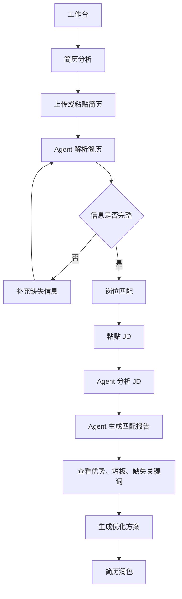
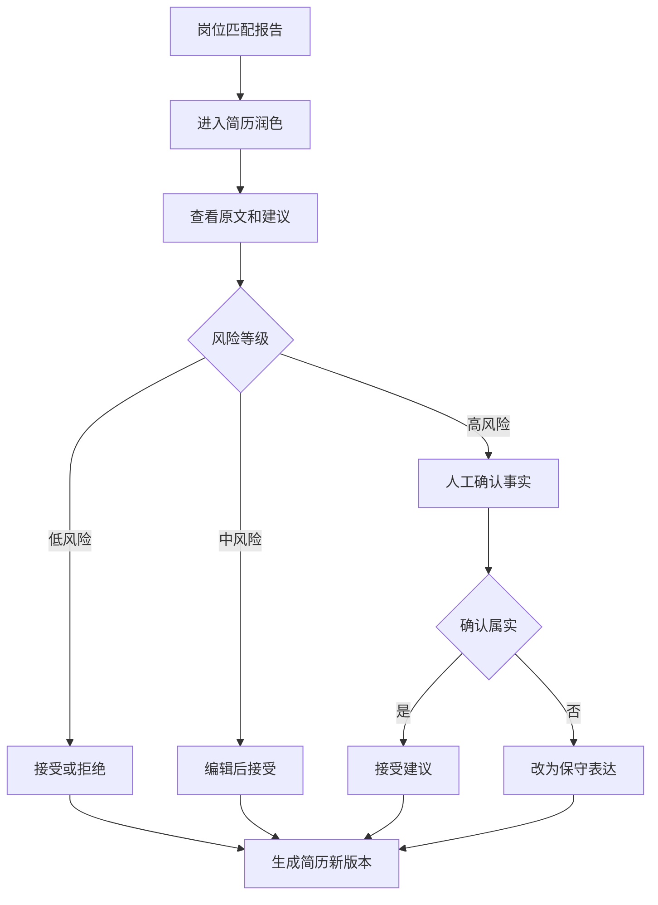
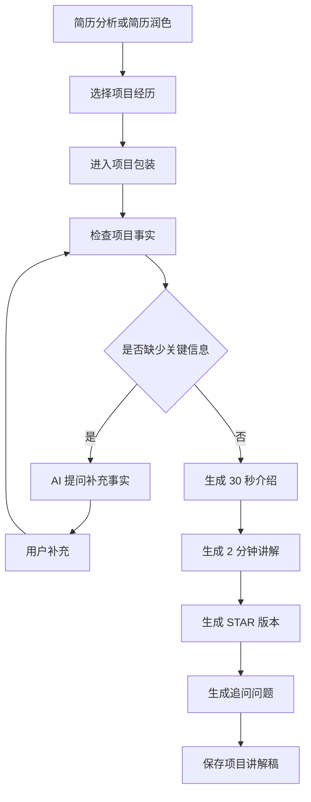
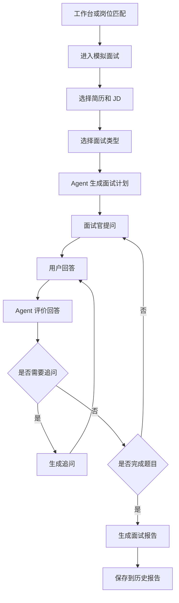
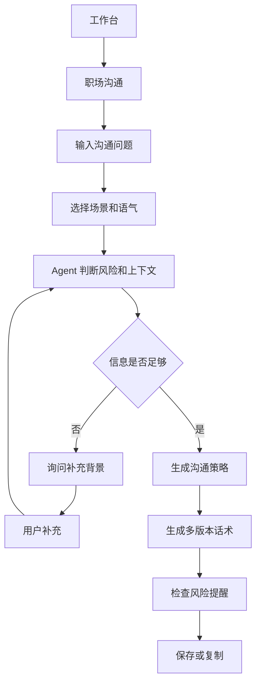

# CareerPilot 职途助手 Design Brief

## 1. 文档用途

本文件用于指导 Google Stitch 生成「CareerPilot 职途助手」的中文 Web App 页面设计。

设计工具需要重点理解：

- 这是一个真实可用的 AI Agent 求职准备产品，不是营销官网。
- 页面应体现专业、高级、科技感、可信赖的产品气质。
- 设计重点是信息架构、页面内容、用户操作路径和 Agent 工作流表达。
- 所有界面文案、按钮、导航、状态、报告内容示例都必须使用简体中文。

本文件不指定具体颜色、阴影、字体数值或细节样式。视觉层面只描述整体审美方向，由设计工具自行完成高质量视觉表达。

## 2. 产品概念

### 2.1 产品名称

CareerPilot 职途助手

### 2.2 产品一句话说明

一个基于 AI Agent 的求职准备工作台，帮助用户完成简历分析、岗位匹配、简历润色、项目经历包装、模拟面试和职场沟通准备。

### 2.3 产品定位

CareerPilot 不是一个普通聊天机器人，也不是一个简单简历模板工具。

它是一个面向真实求职流程的 AI Agent 系统。用户可以围绕一个目标岗位，逐步完成：

1. 上传或输入简历。
2. 解析简历结构。
3. 输入岗位 JD。
4. 分析岗位要求。
5. 生成匹配报告。
6. 获得简历优化建议。
7. 包装项目经历。
8. 进行模拟面试。
9. 查看历史报告和下一步行动。

产品的核心体验应体现“AI 正在帮助用户完成一个复杂任务”，而不是“用户在和一个空白聊天框对话”。

## 3. 目标用户

### 3.1 应届生

需要把课程项目、实习项目、竞赛经历整理成更适合投递和面试表达的内容。

### 3.2 初中级开发者

有真实项目经历，但简历表达偏功能罗列，需要突出技术深度、工程化能力和业务结果。

### 3.3 转行求职者

需要从过往经历中提炼可迁移能力，并解释为什么适合目标岗位。

### 3.4 准备跳槽的职场人

需要针对不同 JD 快速调整简历，并准备 HR 面、技术面、项目深挖和谈薪沟通。

## 4. 整体审美方向

界面应呈现一种“高级职业工具”的气质。

整体感觉应是：

- 专业。
- 冷静。
- 清晰。
- 可信赖。
- 有咨询顾问感。
- 有数据分析产品的秩序感。
- 有 AI 工作流产品的过程感。

避免：

- 营销落地页。
- 夸张大标题。
- 娱乐化表达。
- 卡通感。
- 过多装饰。
- 过于拥挤的后台系统感。
- 只像普通 ChatGPT 包壳。

设计应像一个用户愿意长期使用的职业成长工作台，而不是一次性生成工具。

## 5. 全局信息架构

### 5.1 应用布局

采用标准 Web App 结构：

- 左侧主导航。
- 顶部上下文操作区。
- 中央主工作区。
- 必要时使用右侧辅助面板。

整体页面应有稳定的产品框架，让用户始终知道：

- 当前在哪个模块。
- 当前任务进行到哪一步。
- AI Agent 正在处理什么。
- 用户下一步应该做什么。

### 5.2 左侧导航

导航项：

- 工作台
- 简历分析
- 岗位匹配
- 简历润色
- 项目包装
- 模拟面试
- 职场沟通
- 历史报告
- 设置

导航需要体现产品是一个完整求职准备系统，不是单点工具。

### 5.3 顶部区域

顶部区域根据页面展示：

- 当前页面名称。
- 当前页面一句话说明。
- 搜索入口。
- 用户入口。
- 当前页面的主要操作按钮。

例如：

- 工作台：新建分析。
- 简历分析：上传简历。
- 岗位匹配：开始匹配。
- 模拟面试：新建面试。

## 6. 全局交互原则

### 6.1 Agent 流程可见

产品必须让用户看见 AI Agent 的执行过程。

不要只显示“生成中”。

应展示具体步骤，例如：

- 正在解析简历结构。
- 正在识别岗位核心能力。
- 正在对齐技能和项目经历。
- 正在生成匹配评分。
- 正在检查高风险表述。
- 正在生成最终报告。

这些步骤可以用时间线、节点列表、进度条、任务状态卡片或侧边执行面板展示。

### 6.2 输出必须结构化

AI 输出不应只是一段长文本。

报告和建议应拆成清晰模块：

- 总结。
- 分数。
- 优势。
- 短板。
- 缺失关键词。
- 修改建议。
- 风险提示。
- 下一步行动。

### 6.3 用户始终有控制权

尤其是简历润色和职场沟通场景，AI 不能直接替用户决定。

用户需要可以：

- 接受建议。
- 拒绝建议。
- 编辑建议。
- 要求重新生成。
- 确认事实是否属实。
- 保存或删除报告。

### 6.4 高风险内容需要显式确认

如果 AI 建议可能涉及夸大经历、事实扩展、敏感沟通或谈薪策略，需要出现明确的人工确认状态。

文案示例：

- 需要人工确认。
- 请确认该经历是否真实发生。
- 建议改为更保守表达。
- 该说法可能引发追问，请谨慎使用。

## 7. 页面一：工作台

### 7.1 页面目标

工作台是用户进入产品后的第一屏。它应展示用户当前的求职准备状态，并提供进入核心任务的入口。

它不是欢迎页，也不是品牌宣传页。

### 7.2 页面内容

工作台应包含：

- 用户求职准备概览。
- 最近一次简历评分。
- 已分析的岗位数量。
- 模拟面试次数。
- 已保存报告数量。
- 最近分析记录。
- Agent 执行动态。
- 推荐下一步行动。
- 快捷操作入口。

### 7.3 主要模块

#### 准备状态概览

展示用户当前状态，例如：

- 简历评分：82。
- 最近岗位匹配：AI 应用开发工程师。
- 当前最高匹配岗位：后端 Agent 工程师。
- 待处理建议：3 条。

#### 最近分析

列表展示最近生成的分析报告。

每条记录包含：

- 报告名称。
- 报告类型。
- 关联岗位。
- 评分。
- 生成时间。
- 当前状态。

#### Agent 执行动态

展示最近 Agent 工作流记录。

示例：

- 简历解析完成。
- JD 分析完成。
- 生成 12 个缺失关键词。
- 发现 2 条高风险润色建议。
- 模拟面试报告已保存。

#### 推荐下一步

系统根据用户状态推荐操作：

- 你的简历已解析，建议添加目标岗位 JD。
- 你的匹配报告已生成，建议进入简历润色。
- 你的项目经历缺少量化结果，建议完善项目包装。
- 你已经完成匹配分析，建议开始模拟面试。

### 7.4 主要操作

- 上传简历。
- 粘贴 JD。
- 开始岗位匹配。
- 开始模拟面试。
- 查看历史报告。

## 8. 页面二：简历分析

### 8.1 页面目标

让用户上传或粘贴简历，并将简历转换成结构化信息。

该页面的重点不是“上传文件”本身，而是让用户看到 AI 如何理解自己的简历。

### 8.2 页面结构

页面应分为两个主要区域：

- 输入区。
- 结构化解析结果区。

必要时增加一个 Agent 执行过程区。

### 8.3 输入区

用户可以：

- 上传简历文件。
- 粘贴简历文本。
- 保存草稿。
- 重新解析。

上传区域应说明当前支持格式。MVP 可以体现支持文本和 Markdown，后续支持 PDF 和 DOCX。

### 8.4 结构化解析结果

AI 解析后展示：

- 基本信息。
- 教育经历。
- 技能栈。
- 工作经历。
- 项目经历。
- 获奖证书。
- 自我评价。

每个模块应展示完整性状态。

示例：

- 技能栈：已识别 12 项。
- 项目经历：已识别 3 个项目。
- 量化成果：缺失。
- 个人职责：部分缺失。

### 8.5 缺失信息提醒

如果简历信息不足，系统应提醒用户补充。

示例：

- 项目经历缺少你的个人职责。
- 项目结果缺少量化指标。
- 技能栈中出现 LangChain，但项目经历里没有对应证据。
- 工作经历描述过于笼统，建议补充具体业务场景。

### 8.6 页面流转

用户完成简历解析后，可以进入：

- 岗位匹配。
- 简历润色。
- 项目包装。

## 9. 页面三：岗位匹配

### 9.1 页面目标

用户选择一份简历并输入目标岗位 JD，系统生成可解释的匹配报告。

这个页面是 MVP 的核心页面之一，应具备强烈的分析产品感。

### 9.2 页面结构

建议采用左右分区：

- 左侧是输入和上下文。
- 右侧是匹配结果和报告摘要。

### 9.3 左侧内容

#### 已选择简历

展示：

- 简历名称。
- 最近更新时间。
- 技能摘要。
- 项目数量。
- 当前版本。

用户可以切换简历。

#### 岗位 JD 输入

用户可以粘贴 JD。

JD 输入区需要引导用户填写：

- 岗位职责。
- 任职要求。
- 加分项。
- 公司业务背景。

### 9.4 右侧内容

#### 总体匹配分

展示整体匹配分和一句解释。

示例：

```text
匹配分：82
你的项目经历与 AI 应用开发方向较匹配，但工程化部署和评测经验表达不足。
```

#### 评分拆解

展示：

- 技能匹配。
- 项目匹配。
- 经验匹配。
- 表达质量。

#### 优势

展示用户和岗位匹配的地方。

示例：

- 有 AI Agent 项目规划经验。
- 项目内容覆盖需求、架构、数据结构和流程设计。
- 具备前后端分离项目意识。

#### 短板

展示影响匹配度的问题。

示例：

- 缺少可运行 Demo。
- 缺少真实部署说明。
- 简历中没有突出 LangGraph 状态管理能力。

#### 缺失关键词

展示 JD 中重要但简历未充分体现的关键词。

示例：

- LangGraph。
- RAG。
- 结构化输出。
- Agent Trace。
- Prompt 版本管理。
- Docker 部署。

#### 下一步行动

引导用户进入：

- 生成优化方案。
- 进入简历润色。
- 开始模拟面试。

## 10. 页面四：简历润色

### 10.1 页面目标

让用户逐条处理 AI 生成的简历优化建议。

该页面要体现“AI 提建议，用户做最终确认”的关系。

### 10.2 页面结构

建议使用对照式布局：

- 一侧展示简历原文。
- 一侧展示 AI 建议。

用户需要能快速比较“原文”和“修改后版本”。

### 10.3 建议卡片内容

每条建议包含：

- 所属模块。
- 原文。
- 问题说明。
- 修改后版本。
- 修改理由。
- 风险等级。
- 是否需要事实依据。

示例：

```text
原文：
负责系统开发和接口联调。

问题：
表达过于笼统，没有体现具体模块、技术动作和业务价值。

修改后：
负责用户画像模块的后端接口设计与实现，完成标签查询、画像聚合和缓存优化，支持运营侧按用户分层进行精细化触达。

修改理由：
补充了模块边界、技术动作和业务价值，更适合面试官理解你的贡献。
```

### 10.4 用户操作

每条建议应支持：

- 接受。
- 拒绝。
- 编辑。
- 重新生成。
- 查看风险说明。

### 10.5 高风险建议逻辑

如果建议可能扩展事实，需要进入人工确认。

状态文案：

```text
需要人工确认
这条建议可能涉及事实扩展，请确认你是否真实参与过相关工作。
```

用户选择：

- 确认属实。
- 改为保守表达。
- 删除该建议。

### 10.6 页面流转

用户处理建议后，可以：

- 生成简历新版本。
- 进入项目包装。
- 进入模拟面试。
- 保存到历史报告。

## 11. 页面五：项目包装

### 11.1 页面目标

将简历中的项目经历整理成适合面试表达的项目故事。

这个页面要帮助用户从“写在简历上的项目”过渡到“面试中能讲清楚的项目”。

### 11.2 页面结构

页面应包含：

- 项目选择器。
- 目标岗位方向。
- 项目事实检查。
- 项目讲解结果。
- 面试追问问题。

### 11.3 项目事实检查

系统检查项目是否包含：

- 项目背景。
- 个人职责。
- 技术栈。
- 核心难点。
- 解决方案。
- 结果指标。
- 复盘总结。

每项可以标记为：

- 已补充。
- 待补充。
- 建议量化。

### 11.4 AI 补充提问

如果项目信息不足，AI 应先提问，而不是直接编造。

示例：

```text
为了让这个项目更适合面试表达，请补充：这个项目上线后带来了什么结果？例如性能提升、错误率下降、用户量提升、开发效率提升等。
```

### 11.5 项目讲解内容

项目包装结果应分为多个视角：

- 30 秒介绍。
- 2 分钟讲解。
- STAR 版本。
- 技术亮点。
- 面试追问。

### 11.6 追问问题

系统根据项目内容生成可能被问到的问题。

示例：

- 你在这个项目中具体负责哪部分？
- 为什么选择 LangGraph？
- Agent 状态是怎么设计的？
- 如果模型输出不稳定，你怎么处理？
- 这个项目如何做评测？

## 12. 页面六：模拟面试

### 12.1 页面目标

让用户基于简历和目标岗位进行多轮模拟面试。

该页面要体现真实面试感：提问、回答、评价、追问、总结。

### 12.2 页面结构

建议使用三部分：

- 面试计划。
- 问答区域。
- 实时反馈。

### 12.3 面试计划

展示：

- 面试类型。
- 目标岗位。
- 当前题号。
- 总题数。
- 当前主题。
- 已完成问题。
- 待完成问题。

面试类型包括：

- HR 面。
- 技术一面。
- 技术二面。
- 项目深挖。
- 行为面试。

### 12.4 问答区域

面试官问题示例：

```text
你在 CareerPilot 项目中为什么选择 LangGraph，而不是只用普通的 LangChain Agent？
```

回答输入区引导：

```text
请输入你的回答。建议说明背景、选择原因、具体落地方式和结果价值。
```

操作：

- 提交回答。
- 获取提示。
- 跳过本题。
- 结束面试。

### 12.5 实时反馈

用户提交回答后，AI 输出反馈：

- 回答评分。
- 逻辑结构。
- 技术深度。
- 岗位相关性。
- 表达清晰度。
- 风险提醒。
- 优化建议。

示例：

```text
评分：76

优点：
你说明了 LangGraph 适合有状态流程。

问题：
缺少具体节点例子，例如简历解析、JD 分析、风险校验和人工确认。

建议：
补充为什么这个项目需要可恢复、可追踪和可人工确认。
```

### 12.6 追问逻辑

当回答不够完整时，系统应生成追问。

追问示例：

```text
如果用户在模拟面试过程中刷新页面，你如何恢复当前面试状态？
```

### 12.7 最终报告

面试结束后生成：

- 总体评分。
- 表现亮点。
- 主要问题。
- 高频风险。
- 推荐补充知识点。
- 优化后的回答示例。
- 下一步练习建议。

## 13. 页面七：职场沟通

### 13.1 页面目标

帮助用户在求职和职场沟通场景中生成得体、可执行的话术。

这个页面应像一个职业沟通顾问，而不是通用聊天框。

### 13.2 页面结构

页面包含：

- 场景选择。
- 语气选择。
- 问题输入。
- 背景补充。
- 策略输出。
- 多版本话术。
- 风险提醒。

### 13.3 场景类型

可选择：

- 回复 HR。
- 谈薪。
- 延期说明。
- 冲突沟通。
- 晋升沟通。
- 离职沟通。
- 其他。

### 13.4 语气选择

可选择：

- 礼貌。
- 专业。
- 坚定。
- 简洁。

### 13.5 输出内容

输出应包括：

- 沟通策略。
- 委婉版本。
- 直接版本。
- 不建议说的话。
- 风险提醒。

示例：

```text
沟通策略：
先确认对方诉求，再表达你的边界，最后给出可执行替代方案。

委婉版本：
我理解这个需求比较紧急。目前我手上还有 A 和 B 两项任务。如果这个需求优先级更高，我可以先处理它，但可能需要同步调整原计划。
```

## 14. 页面八：历史报告

### 14.1 页面目标

集中管理用户生成过的所有分析结果。

历史报告不是简单列表，而是用户求职准备过程的沉淀。

### 14.2 页面结构

页面应包含：

- 筛选器。
- 搜索。
- 报告列表。
- 报告详情。
- 导出和删除操作。

### 14.3 报告类型

包括：

- 简历分析报告。
- 岗位匹配报告。
- 简历润色记录。
- 项目包装结果。
- 模拟面试报告。
- 职场沟通建议。

### 14.4 报告卡片

每条报告展示：

- 报告标题。
- 报告类型。
- 关联简历。
- 关联岗位。
- 分数。
- 生成时间。
- 状态。

### 14.5 报告详情

详情结构：

- 总结。
- 分数。
- 优势。
- 短板。
- 优化建议。
- 面试风险。
- 下一步行动。

操作：

- 导出。
- 删除。
- 重新生成。
- 进入模拟面试。

## 15. 核心页面流转

### 15.1 主流程：从简历到岗位匹配



### 15.2 简历润色流程



### 15.3 项目包装流程



### 15.4 模拟面试流程



### 15.5 职场沟通流程



## 16. 页面之间的入口关系

| 当前页面 | 可跳转页面 | 触发动作     |
| ---- | ----- | -------- |
| 工作台  | 简历分析  | 上传简历     |
| 工作台  | 岗位匹配  | 粘贴 JD    |
| 工作台  | 模拟面试  | 开始模拟面试   |
| 简历分析 | 岗位匹配  | 简历解析完成   |
| 岗位匹配 | 简历润色  | 生成优化方案   |
| 岗位匹配 | 模拟面试  | 基于该岗位练习  |
| 简历润色 | 项目包装  | 包装某段项目经历 |
| 项目包装 | 模拟面试  | 使用追问问题练习 |
| 模拟面试 | 历史报告  | 结束面试     |
| 职场沟通 | 历史报告  | 保存沟通建议   |

## 17. 响应式逻辑

### 17.1 桌面端

桌面端是主场景。

应充分利用横向空间：

- 工作台可展示多列信息。
- 岗位匹配可使用左右分区。
- 简历润色可使用原文和建议对照。
- 模拟面试可使用计划、问答、反馈三栏。

### 17.2 平板端

平板端需要保持核心任务可用：

- 导航可收起。
- 双栏变为上下布局。
- 右侧反馈可变为抽屉或下方区域。

### 17.3 移动端

移动端可以简化为任务流：

- 导航变为抽屉或底部入口。
- 报告列表使用卡片。
- 模拟面试按“问题、回答、反馈”分步骤展示。
- 避免同时展示过多复杂信息。

## 18. Stitch 生成要求

请 Google Stitch 根据本文件生成中文 Web App 页面，并遵守：

1. 所有 UI 文案必须使用简体中文。
2. 第一屏是工作台，不要生成营销落地页。
3. 页面应体现高级、专业、可信赖的 SaaS 产品气质。
4. 重点展示页面内容、任务流程、Agent 执行过程和结构化报告。
5. 不需要在页面中解释产品功能说明，界面本身应直接可用。
6. 每个核心页面都要有清晰主操作。
7. AI 输出要以结构化模块展示，不要只生成聊天气泡。
8. 简历润色必须体现原文和建议对照。
9. 高风险建议必须出现人工确认逻辑。
10. 模拟面试必须体现多轮提问、回答、追问和反馈。
11. 历史报告需要体现这是用户长期求职准备过程的沉淀。

## 19. 可直接给 Stitch 的简短提示

```text
请根据 design.md 设计一个中文桌面端 Web App「CareerPilot 职途助手」。这是一个基于 AI Agent 的求职准备工作台，包含简历分析、岗位匹配、简历润色、项目包装、模拟面试、职场沟通和历史报告。请设计成高级、专业、可信赖的 SaaS 产品，不要做营销落地页。第一屏是工作台。重点体现页面内容、用户任务流、Agent 执行过程、结构化报告、原文与建议对照、高风险人工确认、多轮模拟面试反馈。所有界面文案必须是简体中文。
```

